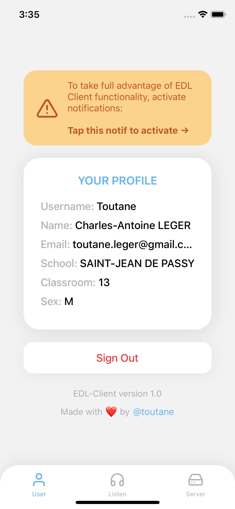
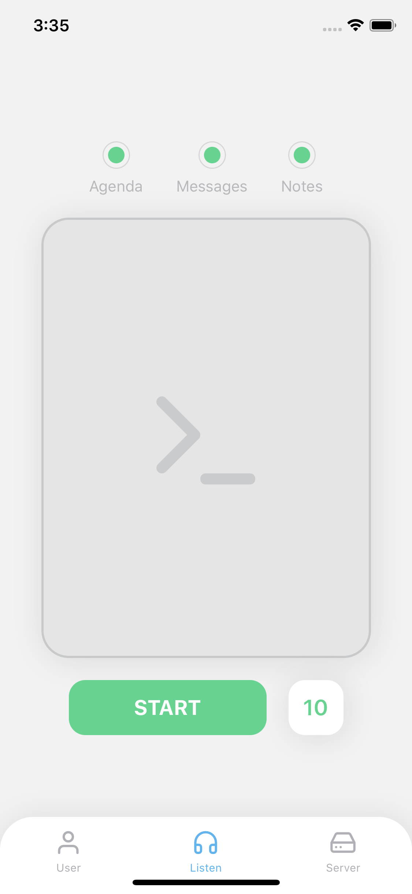
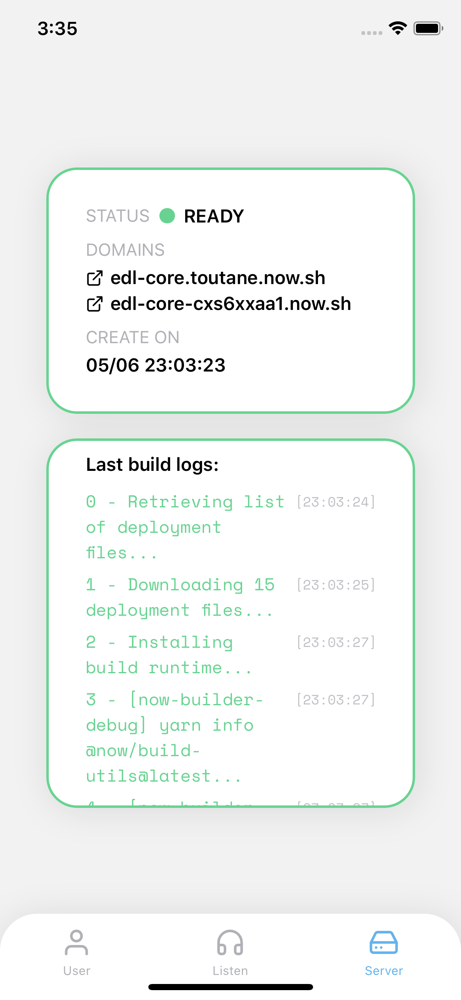
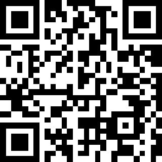

# Ecole Directe Listener

> **Disclamer**: This project is under development. It may still contain bugs, its performance is not optimal and its operation is not guaranteed.

## Screenshots

<p float="left">
  
  
  
</p>

## The Project

The idea of this project is as follows: send a notification to your mobile when one of your teachers gives you a new grade, puts you some work to do or sends you a message on the [Ecole Directe] platform.

Indeed, this platform allows schools like mine to communicate and share information with its students via a site and an app. This is useful during periods of confinement when pupils do not go to school, for example. However, [this app] with a slightly old-fashioned look and poor performance does not send you notifications when new information appears.

This project starts from this observation. It would be useful for the student to be notified of any new event related to his account. This project solves this problem. Download the app on your mobile, log in with your Ecole Directe credentials, start listening to your account and that's it! the application will send you a notification as soon as you have additional work, a new message or a new note.

[Ecole Directe]: https://www.ecoledirecte.com
[this app]: https://apps.apple.com/fr/app/mon-ecoledirecte/id1296851886


## How it works (basically)

As the Ecole Directe platform does not offer an API for listening to modifications in the establishment's database, it was necessary to find a solution to allow us to know when new data appeared in the student's account.

The solution: regularly check for changes and notify the user when there is one.

To see if there is a change between a query n and a query n + 1, Ecole Directe Listener stores in mLab for each listening the data of query n and compares it with the new data of query n + 1, if it are different: it sends you a notification, otherwise the process continues. Attention, even if there are changes, nothing stop.


## How it works (more precisely)

Although this project allows me to respond to a real need, it also allows me to manipulate different techonologies and to play with them, in particular through the APIs that they offer. Among these are:

* **[Expo]** and **[React Native]** for the development of the app, the client side
* **[Vercel]** and its **[serverless functions]** for the backend part
* **[mLab]** for keeping the data of the current listening
* **[Easy Cron Jobs]** for the periods between each request to Ecole Directe

[Expo]: https://github.com/expo/expo
[React Native]: https://github.com/facebook/react-native
[Vercel]: https://github.com/vercel/vercel
[serverless functions]: https://vercel.com/docs/v2/serverless-functions/introduction
[mLab]: https://mlab.com/
[Easy Cron Jobs]: https://www.easycron.com/

## Installation

_To run the lasted Expo build on your iPhone, scan this code:_



 _To get the in developpment app:_

- Clone this repo to your computer using this command:

```shell
git clone git@github.com:toutane/ecole-directe-listener.git
```

- Go inside the client directory, install dependencies and start Expo clien:

```shell
cd ecole-directe-listener
cd edl-client
npm install
expo start
```
